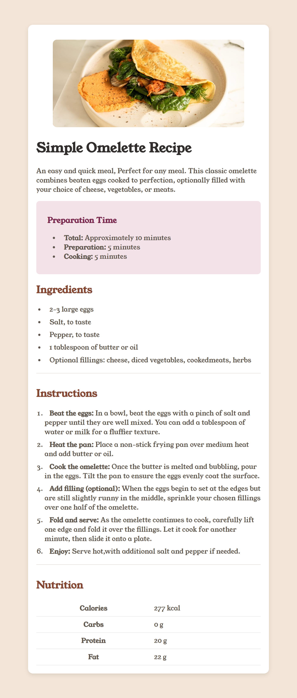

# 🍳 Simple Omelette Recipe

A simple and quick omelette recipe webpage built using **HTML, CSS, and JavaScript**.

## 📸 Preview

## 🚀 Features
- Responsive design for mobile and desktop  
- Well-structured HTML and CSS  
- Clean and readable layout  
- Simple and easy-to-follow recipe instructions  

## 📂 Project Structure

## 🛠️ Technologies Used
- **HTML** for structure  
- **CSS** for styling  
- **Git & GitHub** for version control  

## 🌐 Live Demo
Check out the live version on **[Vercel](https://recipe-page-eight-iota.vercel.app/)** (replace with your actual link).  

### Clone the repository:

git clone https://github.com/GloTech-W/recipe-page.git
